## Introduction

The purpose of this repository aims to provide a hands-on architecture PoC(proof-of-concept) sample that are easy to understand and demonstrate how to **build** and **run** a `microservices architecture`(MSA) application based on the ecosystem comprises of the excellent technologies offering by `Spring-Cloud`, `Hashicorp`, `Elastic`,  `Netflix` and etc. 

## Microservices Landscape in Spring-Cloud ecosystem

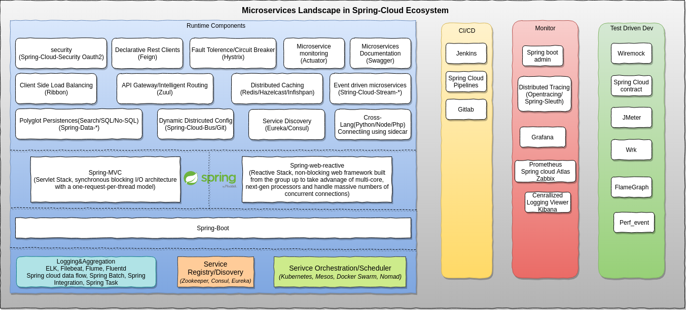

## PoC Scenario 

### Overview

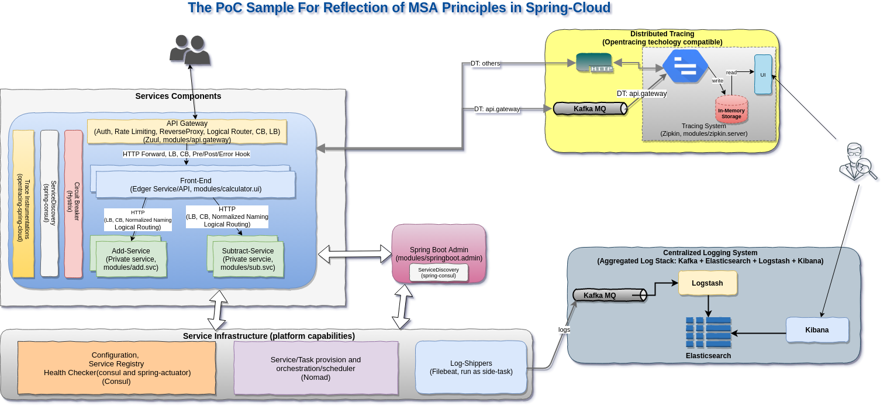

The PoC sample pursue to cover below functionalities:
 
 - Dev
    - APIDoc(Swagger based)
    - TDD
    - Environemnt typed configuration(Spring profiles)
    
 - Service Interconnectivity(Application/Infrastructure Runtime)
    - API-Gateway(Edger service)
    - Service Discovery
    - Intra-Communication Load Balance (Private service)
    - Circuit Breakers
    - Intelligent Routing
    - Distributed Tracing Instrumentation(OpenTracing API based)
     
  - Service Orchestration (Infrastructure Runtime)
    - Service Orchestration(support hybrid deployables)
    - Aggregated Logging(which enabled via attaching a sidecar log-shipper task)
     
  - Ops
    - Service Admin
    - Service Allocation Status(Hashi-ui)
    - Distributed Tracing Reporter(Zipkin-ui)
    - Centralized Logging Reporter (Kibana)
    -  `nmon` system overall performance sampling 
    - Java Memory Analysis(Oracle JDK and IBM JDK)
    - Java Core Dump Analysis(Oracle JDK and IBM JDK)
    - perf\_event + flamegraph profiling (Linux only)
    - wrk
 
 > Notable:
 >
 >    CI/CD refer to the combined practices of `continuous integration` and `continuous delivery`
 >  
 >    In order to keep the PoC sample as simple as possible, I didn't involve CI/CD features here. 

### Spring-Boot Modules

```

├── modules
│   ├── add.svc            // add operator service, which will be called by calculator-ui
│   │   ├── build.gradle
│   │   ├── out
│   │   └── src
│   ├── api.gateway       // api.gateway based on Zuul
│   │   ├── build.gradle
│   │   ├── out
│   │   └── src
│   ├── calculator.ui     // front-end service(edge service), which will be exposed on public cloud
│   │   ├── build.gradle
│   │   ├── out
│   │   └── src
│   ├── springboot.admin  // spring-boot admin service
│   │   ├── build.gradle
│   │   ├── out
│   │   └── src
│   ├── sub.svc           // subtract operator service, which will be called by calculator-ui
│   │   ├── build.gradle
│   │   ├── out
│   │   └── src
│   ├── turbine.aggr      // turbine aggregation service
│   │   ├── build.gradle
│   │   ├── out
│   │   └── src
│   └── zipkin.server     // Zipkin server(with HTTP and kafka collectors, in-memory span storage)
│       ├── build.gradle
│       ├── out
│       └── src


```

## Run the sample in standalone mode(w/o ops support)

### Start Consul (listening on port 8500)

```shell
cd <CONSUL_HOME>
./bin/consul agent -dev
```

### Start Zookeeper and Kafka(bootstrap port 9092)

```shell
cd <KAFKA_1.0_HOME>
./bin/zookeeper-server-start.sh ./config/zookeeper.properties
./bin/kafka-server-start.sh ./config/server.properties
```

In this sample, the `api-gateway` distributed tracing will be reported to Kafka topic `zipkin`, we can monitor that topic and verify the result:

```shell
./bin/kafka-console-consumer.sh --bootstrap-server localhost:9092 --topic zipkin
```

### Start Zipkin Server(web-ui listening on port 9411)

Either start Zipkin by Zipkin binary

```shell
cd <ZIPKIN_SRC_HOME>
./mvnw -DskipTests --also-make -pl zipkin-server clean install
KAFKA_BOOTSTRAP_SERVERS=localhost:9092 java -jar ./zipkin-server/target/zipkin-server-2.11.2-SNAPSHOT-exec.jar
```

 > 
 > Please refer to [zipkin native kafka collector auto-configure support](https://github.com/openzipkin/zipkin/tree/master/zipkin-autoconfigure/collector-kafka) for more details
 > 

or lanuch the Zipkin server via an embedded spring boot module

```shell
cd modules/zipkin.server
spring bootRun
```

### Start Spring-Boot-Admin(listening on port 9080)

```shell
cd modules/springboot.admin
gradle bootRun
```

### Start Turbine Aggration Server(listening on port 9090)

```shell
cd modules/springboot.admin
gradle bootRun
```

### Start api-gateway (listening on port 2809)

```shell
cd modules/api.gateway
gradle bootRun
```

### Start add service (dynamical port) 

```shell
cd modules/add.svc
gradle bootRun
```

### Start subtract service (dynamical port) 

```shell
cd modules/sub.svc
gradle bootRun
```

### Start calculator-ui service (dynamical port) 

```shell
cd modules/calculator.ui
gradle bootRun
```

### Run the sample via Command Line

```shell
curl -X POST "http://localhost:2809/calculator-ui/api/v1/compute" -H "accept: application/json" -H "Content-Type: application/json" -d "{ \"expression\": \"1+1+2+3+4+5+6-1-2-3-4-5-6+9+8-4-5\"}"
```

### Run the sample with High load (assuming `wrk` is ready in your workstation)

calculator.lua:

```lua
wrk.method = "POST"
wrk.headers["Content-Type"] = "application/json"
wrk.body   = "{ \"expression\": \"1+1+2+3+4+5+6-1-2-3-4-5-6+9+8-4-5\"}"
```

```shell
   wrk -t 200 -c 200 -s ./scripts/calculator.lua -d 60s --latency http://localhost:2809/calculator-ui/api/v1/compute
   
```

## Circuit Breaker(Hystrix)

### Scenario

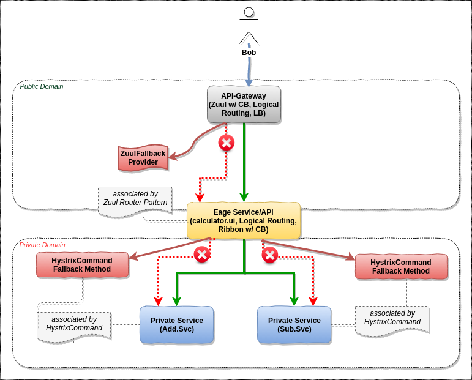


### Hystrix

 >
 > Please refer to [Hystrix](https://github.com/Netflix/Hystrix/wiki/How-it-Works) for more details about how Hystrix works.
 >


### Turbine Aggregation

```
  - Open browser and input url  http://localhost:9090/hystrix
  - Input dashboard stream url as below: 
    [1] http://localhost:9090/turbine.stream?cluster=api-gateway
    [2] http://localhost:9090/turbine.stream?cluster=calculator-ui
```

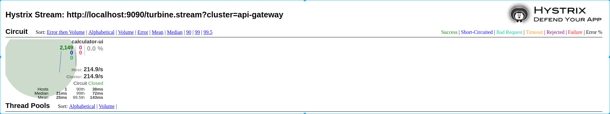

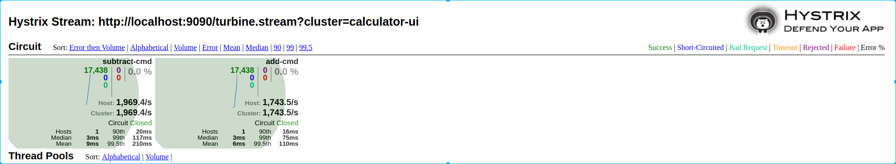


## Distributed Tracing

Microservices architecture faces certain challenges that are not common for monolithic systems – one of them is traceability of end-to-end transaction that is executed in distributed environment and that can potentially involve invocation of large number of diverse applications and services. In case of performance degradation or fatal exception thrown that is experienced in end-to-end solution, identication of bottleneck component/failure point become more and more diffcult. `Distributed tracking` is used to resolve the problems in this area.

> In this PoC sample, I'm using [`opentracing-spring-cloud`](https://github.com/opentracing-contrib/java-spring-cloud) instead of [`spring-cloud-sleuth`](https://github.com/spring-cloud/spring-cloud-sleuth), as it will bring us more benifits for cross porgramming languages environment, as well the switching from [Zipkin](https://github.com/openzipkin/zipkin) to others, e.g: [Jaeger](https://github.com/jaegertracing/jaeger).

`opentracing-spring-cloud` contains auto-configurations which can be enabled to instruments and trace following Spring Boot projects:

 - Spring Web (RestControllers, RestTemplates, WebAsyncTask)
 - @Async, @Scheduled, Executors
 - WebSocket STOMP
 - Feign, HystrixFeign
 - Hystrix
 - JMS
 - JDBC
 - Mongo
 - Zuul
 - RxJava
 - Standard logging - logs are added to active span
 - Spring Messaging - trace messages being sent through Messaging Channels
 - RabbitMQ

### Zipkin

#### Components Architecture (includes both span generator side and consumer side)

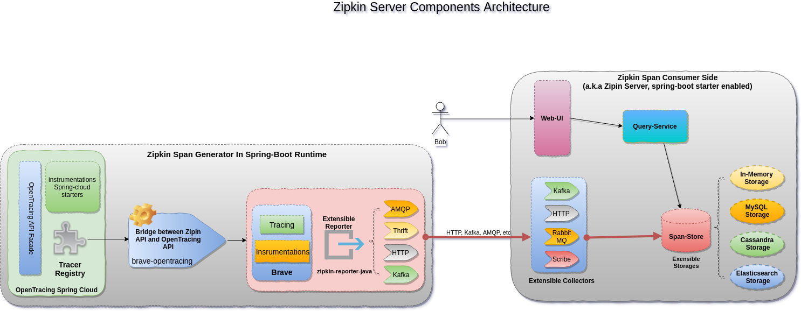

#### Workflow

 >
 > Below is the description from [zipkin architecture doc](https://github.com/openzipkin/openzipkin.github.io/blob/master/pages/architecture.md)
 >


Here's an example sequence of http tracing where user code calls the resource
/foo. This results in a single span, sent asynchronously to Zipkin after user
code receives the http response.

```
┌─────────────┐ ┌───────────────────────┐  ┌─────────────┐  ┌──────────────────┐
│ User Code   │ │ Trace Instrumentation │  │ Http Client │  │ Zipkin Collector │
└─────────────┘ └───────────────────────┘  └─────────────┘  └──────────────────┘
       │                 │                         │                 │
           ┌─────────┐
       │ ──┤GET /foo ├─▶ │ ────┐                   │                 │
           └─────────┘         │ record tags
       │                 │ ◀───┘                   │                 │
                           ────┐
       │                 │     │ add trace headers │                 │
                           ◀───┘
       │                 │ ────┐                   │                 │
                               │ record timestamp
       │                 │ ◀───┘                   │                 │
                             ┌─────────────────┐
       │                 │ ──┤GET /foo         ├─▶ │                 │
                             │X-B3-TraceId: aa │     ────┐
       │                 │   │X-B3-SpanId: 6b  │   │     │           │
                             └─────────────────┘         │ invoke
       │                 │                         │     │ request   │
                                                         │
       │                 │                         │     │           │
                                 ┌────────┐          ◀───┘
       │                 │ ◀─────┤200 OK  ├─────── │                 │
                           ────┐ └────────┘
       │                 │     │ record duration   │                 │
            ┌────────┐     ◀───┘
       │ ◀──┤200 OK  ├── │                         │                 │
            └────────┘       ┌────────────────────────────────┐
       │                 │ ──┤ asynchronously report span     ├────▶ │
                             │                                │
                             │{                               │
                             │  "traceId": "aa",              │
                             │  "id": "6b",                   │
                             │  "name": "get",                │
                             │  "timestamp": 1483945573944000,│
                             │  "duration": 386000,           │
                             │  "annotations": [              │
                             │--snip--                        │
                             └────────────────────────────────┘
```

Trace instrumentation report spans asynchronously to prevent delays or failures
relating to the tracing system from delaying or breaking user code.

### Zipkin-UI

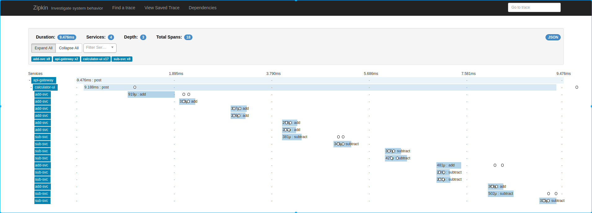

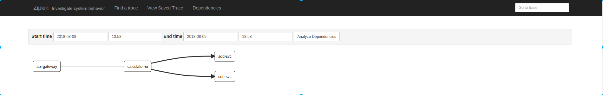


## Spring Boot Admin UI

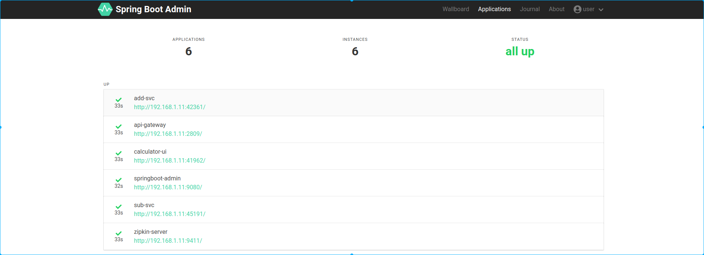

//TODO, more deep dive usage

## APIDoc(Swagger)

In Spring-Cloud, the RESTful API actually play the key role in the ecosystem. Why/How do we document our RESTful API?

### Why

The most important design principle for RESTful Services is `Think about consumer of the API`, Not like SOAP-Based Web service, REST does not provide a spec or a contract like `WSDL` in SOAP. Indeed, REST gives you the flexibility to choose proper documentation format and approach. But that does not mean “No documentation”. We do need to document our API.

### How

- Poor man's option is to maintain documentation manually. But that gets you to much boring work for the doc to sync up with the latest code, and also versioning work.

- An Other option is to generate documentation from code. Spring-Cloud provides an easy way to do this. The PoC


There are multiple approaches to documenting your RESTful API

    - [WADL](https://javaee.github.io/wadl/)
    - RESTDocs                                          
    - Swagger or OpenDocs
    
Swagger appears in the last couple of years and is now the most popular REST API documentation standard. We will use it in our sample for APIDoc generation

### Generating Swagger Document

To generate swagger document, [springfox](https://springfox.github.io/springfox/) currently provides a popular solution in spring-boot. We just need to introduce the dependence to `springfox-swagger2`, configure the Docket, using the appropriate annotations on the API router, method and models, then the swagger document will be generated automatically. 
Access it via:

```
http://<hostname>:<port>/v2/api-docs
```

If we want a visual UI and execute the API with test request, just add a dependence to `springfox-swagger-ui`. and open below link in browser:

```
http://<hostname>:<port>/swagger-ui.html
```

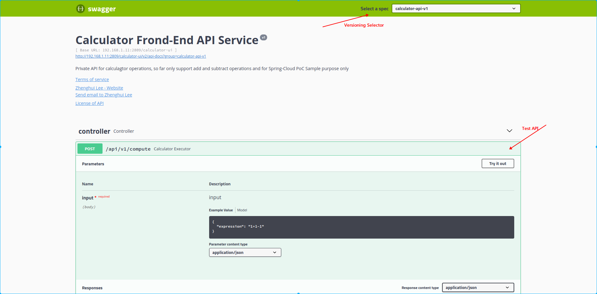


## Test Driven

//TODO

## Performance Testing/Analyse

### FlameGraph with Perf_Event (Linux only)

#### Prerequisites

- Have perf_event tool installed on your linux environment

```
# On Ubuntu
sudo apt-get install -y linux-tools-common
```

  >
  > The sample was verified on ubuntu with kernel below:
  >
  > _Linux lizh-laptop 4.4.0-72-generic #93~14.04.1-Ubuntu SMP Fri Mar 31 15:05:15 UTC 2017 x86_64 x86_64 x86_64 GNU/Linux_
  
- Using JDKv8(>=v8u60) or JDKv9 to support `-XX:+PreserveFramePointer`
```
$ java -version
java version "1.8.0_60"
Java(TM) SE Runtime Environment (build 1.8.0_60-b27)
Java HotSpot(TM) 64-Bit Server VM (build 25.60-b23, mixed mode)
```
- Set JAVA_HOME properly
```
export JAVA_HOME=<YOUR_JDK_HOME>
```
- Install [perf-map-agent](https://github.com/jrudolph/perf-map-agent)

  `perf-map-agent` is the instrument tool to translate the `Java Symbols` for `perf_event`, that means perf_event will read the map to unerstand the `VMA`(Virutal Memory Address) to corresponding Java symbols, and generate a human readble report 
```
sudo apt-get install -y cmake    
git clone https://github.com/jrudolph/perf-map-agent
cd perf-map-agent
cmake .
make
```
  `attach-main.jar` and `libperfmap.so` get compiled in the out folder
- Create command links in `<HOME>/bin`
```
cd <perf-map-agent_HOME>/bin
./create-links-in <HOME>/bin
```
  A soft link for `perf-java-flames` command will be created in `<HOME>/bin`, so we can use this command anywhere without the need of full path specified.
- Install [FlameGraph](https://github.com/brendangregg/FlameGraph)
```
git clone https://github.com/brendangregg/FlameGraph
export FLAMEGRAPH_DIR=<FlameGraph_HOME>
```

#### Profiling Java(on-cpu-sampling)

- Run Java process with `-XX:+PreserveFramePointer`, e.g:
```
cd <modules>/calculator.ui
java -XX:+PreserveFramePointer -jar ./out/libs/calculator.ui-1.0.0.jar
```
- Check it is enabled(on Linux)
```
ps wwp `pgrep -n java` | grep PreserveFramePointer
```
- Profiling and generate flamegraph for the Java process
```
perf-java-flames <pid>
```

- Sample result


### Heap Analysis

- Oracle JVM

Tools: `jmap` and [ibm-heap-analyzer](https://www.ibm.com/developerworks/community/groups/service/html/communityview?communityUuid=4544bafe-c7a2-455f-9d43-eb866ea60091)

  -  Steps:

    1. Generate a heap dump for a java process(e.g: pid 5258)

```
jmap -dump:format=b,file=./heapdmp-calculator.ui-5258.bin 5258
```

    2. Open the heap dump file(`heapdmp-calculator.ui-5258.bin`) with `ibm-heap-analyzer`

```
cd <ibm-ha_home>
java -Xmx4g -jar ha456.jar 
```

 - Result:
 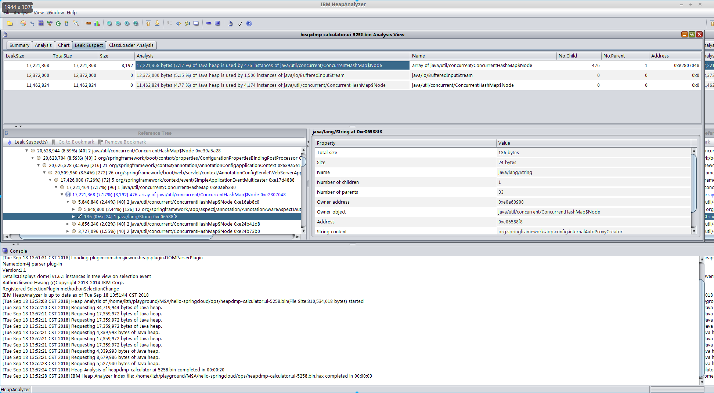

- IBM JVM

To enable signal-based Java Heap dumps, the `IBM_HEAPDUMP=TRUE` environmental variable or the appropriate `JAVA_DUMP_OPTS` must be set.  e.g:

```
# Manually trigger a heap dump by sending a specific signal to JVM
IBM_HEAPDUMP=TRUE ~/opt/ibm-jdk-1.8.0/bin/java -jar ./add.svc-1.0.0.jar # the pid is 21046
kill -3 21046
```

The heapdump file location will be printed in the java process stdout

```
JVMDUMP032I JVM requested Heap dump using 'heapdump.20180918.195336.21046.0001.phd' in response to an event
JVMDUMP010I Heap dump written to heapdump.20180918.195336.21046.0001.phd
```

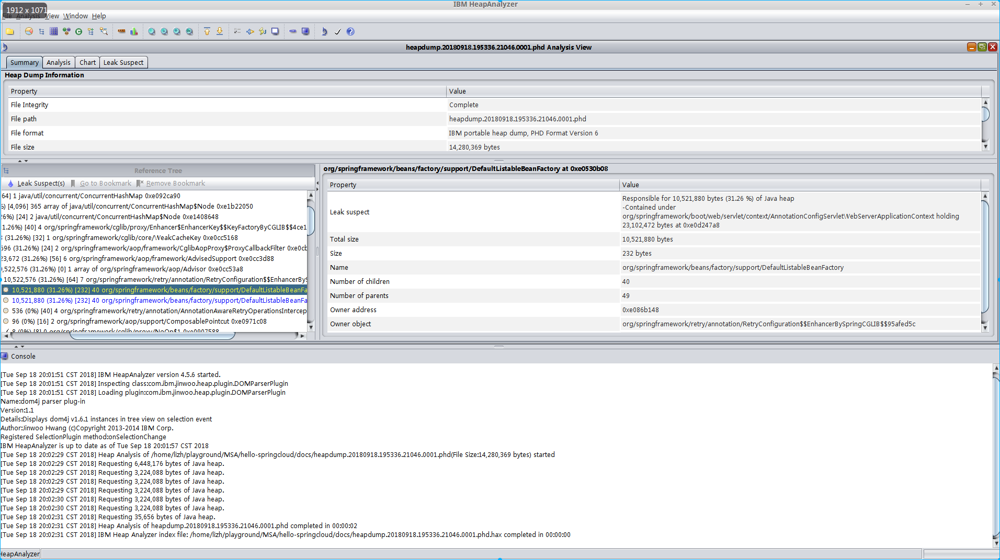

### Core-dump Analysis

- Oracle JVM, we commonly have 3 methods for the thread(core) dump on Linux:

1. Method-1
```
# make you have gdb installed, which provides gcore command to do the core dump.
gcore <java pid> # e.g: pid: 7737
jstack -m -l `which java` ./core.7737 > java-7737.core
```
Result: [java-7737.core](docs/java-7737.core)
> Note:
>
> Before use gcore generate core dump, please run the `ulimit -c` command to check or set the core file size limit. Make sure that the limit is set to `unlimited`; otherwise the core file could be truncated
>
> `jstack <executable> <core>` also usually be used in postmortem situation 

2.  Method-2
You can use jstack to attach to the running java program for the thread dump
```
jstack -l -m -F <pid>
```

3.  Method-3
```
kill -3 <pid> # print the dump info in the java process stdout
```

- For IBM JVM, the core dump file contains much more contents, and we can use [IBM Thread and Monitor Dump Analyzer](https://www.ibm.com/developerworks/community/groups/service/html/communityview?communityUuid=2245aa39-fa5c-4475-b891-14c205f7333c) for the analysis

```
# Manually trigger a javacore dump by sending a specific signal to JVM
kill -3 <pid>
```

JVM log will point you to the location of javacore dump
```
JVMDUMP039I Processing dump event "user", detail "" at 2018/09/18 18:24:03 - please wait.
JVMDUMP032I JVM requested Java dump using 'javacore.20180918.182403.10902.0001.txt' in response to an event
JVMDUMP010I Java dump written to javacore.20180918.182403.10902.0001.txt
JVMDUMP013I Processed dump event "user", detail "".
```
Result: 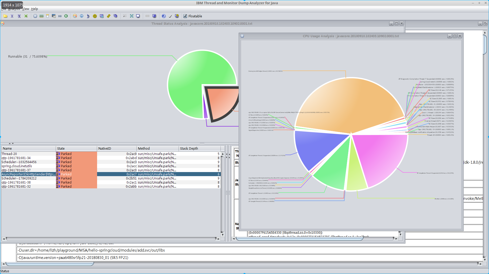

## Run sample in full-feature mode(with ops support)

### Folder structure

```
ops
├── Vagrantfile   // Vagrant file
├── ansible       // ansible scripts for install and start services, including: commoent runtime dependences, zookeeper, kafka, nginx(for local pkgs repo), install JVM, filebeat, consul, nomad, elasticsearch, logstash, kibana and wrk
├── bin           // script, including boostrap.sh, click.sh(fire an invocation on the sample), kafka-*-monitor.sh, start_all_jobs.sh and stop_all_jobs.sh
├── deployable    // nomad job definition files(hcl) for microservices
├── deps          // binary dependences, which cache it locally to reduce(avoid) network deps during demonstration
├── dist          // pkgs publish folder, nginx is started on this folder to simulate a pkg repository
└── log-shipper   // filebeat conf for log-shipper side-task
```

### How to run

#### Pack

To keep the sample simple, I didn't introduce a real CI dependence(e.g: usually gitlab, jenkins, etc) here. Just create a gradle `deploy` task to pack the deployables to a folder named `dist`. Later, when the VM provisioned, the `nginx` will start up and provide a http pkgs server on that folder.

```shell
cd <hello_springcloud_home>
gradle clean build
gradle deploy
``` 

#### Launch VM

The sample is using `[vagrant](https://www.vagrantup.com/docs/installation/)` to manage the VM. Make sure you have `vagrant` installed on your host.

```shell
vagrant up
```

#### Install&Startup all of runtime dependences

All of runtime dependences, including common dependences, elasticsearch, filebeat, hashi-ui, JAVA-v8, kafka, kibana, logstash, nginx, nomad, wrk and zookeeper are managed via ansible, which will be initialized during VM provision. 

```shell
vagrant provision
```

#### Start all jobs

```shell
vagrant ssh
cd /vagrant/bin
./start_all_jobs.sh
```

#### Launch Hashi-UI

Open the browser on your host with url "http://10.10.10.200:3000"

##### Cluster overview shown in Hashi-UI

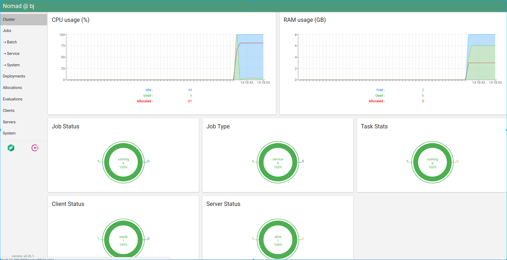

##### Jobs status in Hashi-UI

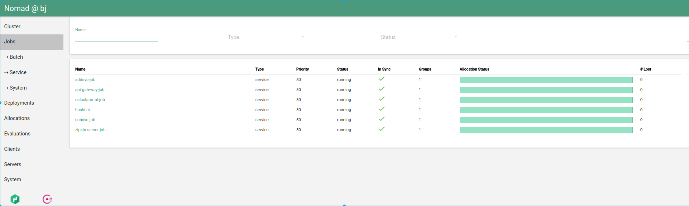

##### Overall allocations status in Hashi-UI

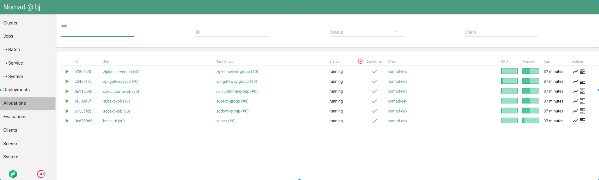

##### Allocation status in Hashi-UI

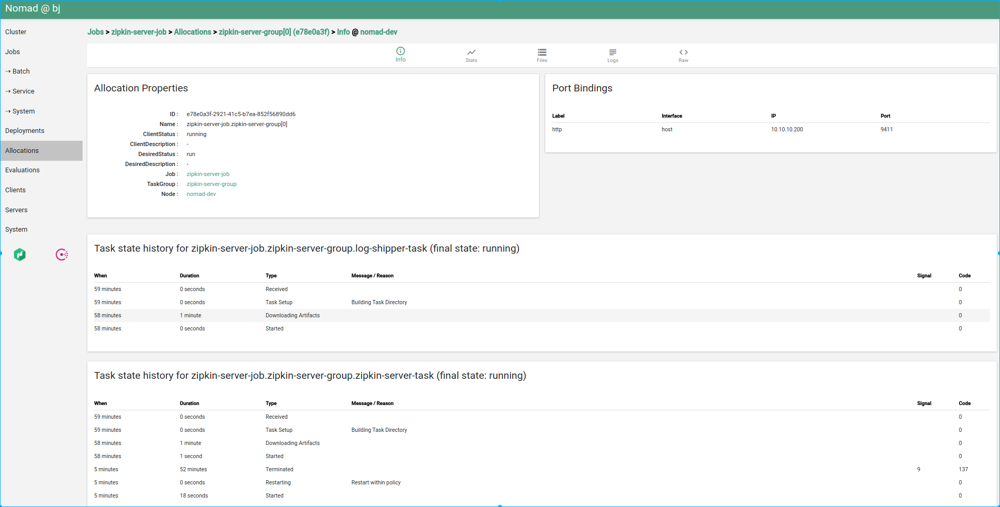

##### Consul status in Hashi-UI

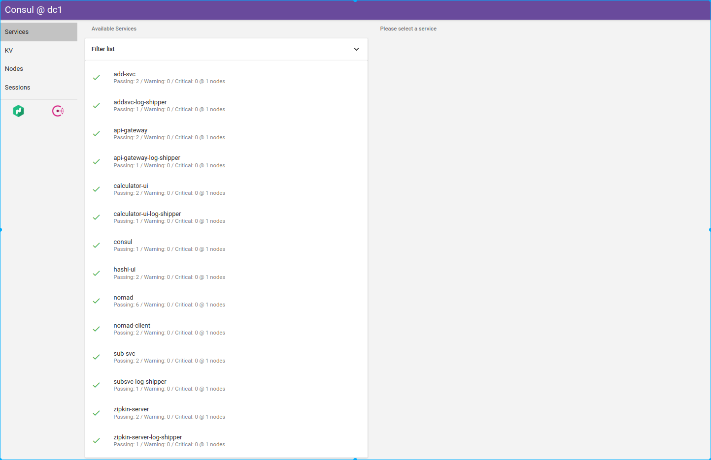


#### Run the sample

```shell
vagrant ssh
cd /vagrant/bin
./click.sh
```

If the sample run successfully, you will see output in stdout as below:

```json
{"result":9}
```

#### Monitor the Kafka distributed tracing topic(zipkin)

In this sample, only apigateway's distributed tracing is reported to kafka. Other services will report trace via HTTP protocol

```shell
vagrant ssh
cd /vagrant/bin
./kafka-zipkin-topic-monitor.sh
```

run the sample, you will see the message like below:

```json
[{"traceId":"ebe29e701126f8a2","parentId":"ebe29e701126f8a2","id":"499be36840d38ffb","name":"post","timestamp":1536129010924681,"duration":32367,"localEndpoint":{"serviceName":"api-gateway","ipv4":"10.0.2.15"},"tags":{"component":"zuul","http.status_code":"200"}},{"traceId":"ebe29e701126f8a2","id":"ebe29e701126f8a2","kind":"SERVER","name":"post","timestamp":1536129010924004,"duration":34677,"localEndpoint":{"serviceName":"api-gateway","ipv4":"10.0.2.15"},"tags":{"component":"java-web-servlet","http.method":"POST","http.status_code":"200","http.url":"http://10.10.10.200:2809/calculator-ui/api/v1/compute"}}]
```

#### Monitor the Kafka aggregated logging topic(api-gateway-filebeat)

In this sample, only apigateway's aggregated logging is shipped to kafka. Other services will shipped to filebeat's stdout.

```shell
vagrant ssh
cd /vagrant/bin
./kafka-filebeat-topic-monitor.sh
```

run the sample, you will see the message like below:

```
{"@timestamp":"2018-09-05T06:34:20.283Z","@metadata":{"beat":"filebeat","type":"doc","version":"6.4.0","topic":"api-gateway-filebeat"},"input":{"type":"log"},"beat":{"version":"6.4.0","name":"hello-springcloud","hostname":"hello-springcloud"},"host":{"name":"hello-springcloud"},"source":"/data/nomad/data/alloc/c24d5f7a-c476-9aec-da51-6274a8e990e5/alloc/logs/api-gateway-task.stdout.0","offset":916841,"message":"[DEBUG]: [Enter]: [POST] -\u003e http://10.10.10.200:2809/calculator-ui/api/v1/compute","prospector":{"type":"log"}}
{"@timestamp":"2018-09-05T06:34:20.283Z","@metadata":{"beat":"filebeat","type":"doc","version":"6.4.0","topic":"api-gateway-filebeat"},"message":"[DEBUG]: \u003e\u003e\u003e Content-Type: application/json","source":"/data/nomad/data/alloc/c24d5f7a-c476-9aec-da51-6274a8e990e5/alloc/logs/api-gateway-task.stdout.0","offset":916923,"prospector":{"type":"log"},"input":{"type":"log"},"beat":{"name":"hello-springcloud","hostname":"hello-springcloud","version":"6.4.0"},"host":{"name":"hello-springcloud"}}
{"@timestamp":"2018-09-05T06:34:20.283Z","@metadata":{"beat":"filebeat","type":"doc","version":"6.4.0","topic":"api-gateway-filebeat"},"source":"/data/nomad/data/alloc/c24d5f7a-c476-9aec-da51-6274a8e990e5/alloc/logs/api-gateway-task.stdout.0","prospector":{"type":"log"},"input":{"type":"log"},"beat":{"name":"hello-springcloud","hostname":"hello-springcloud","version":"6.4.0"},"host":{"name":"hello-springcloud"},"offset":916967,"message":"[DEBUG]: [Exit]: [POST] [200] \u003c- http://10.10.10.200:2809/calculator-ui/api/v1/compute"}
```

#### Run benchmark

```shell
vagrant ssh
cd /vagrant/bin
./benchmark.sh
```

Output:

```output
Running 1m test @ http://localhost:2809/calculator-ui/api/v1/compute
  5 threads and 5 connections
  Thread Stats   Avg      Stdev     Max   +/- Stdev
    Latency   123.07ms  158.81ms   1.88s    95.71%
    Req/Sec    11.32      6.36    40.00     56.93%
  Latency Distribution
     50%   87.95ms
     75%  138.00ms
     90%  205.89ms
     99%    1.01s 
  2985 requests in 1.00m, 437.76KB read
Requests/sec:     49.72
```
The `nmon` command running in background to do the sampling, the overall system performance analysis result is **[hello-springcloud_180918_0439.nmon.xlsx](./docs/hello-springcloud_180918_0439.nmon.xlsx)**

#### Observe Distributed Tracing Result

Open browser on host machine with url `http://10.10.10.200:9411`

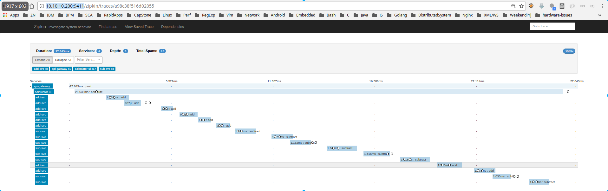

#### Observe centralized logging

Open browser on host machine with url `http://10.10.10.200:5601`

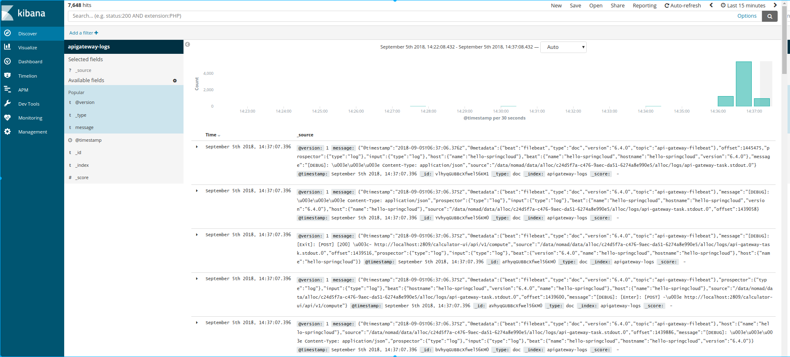

#### Stop all jobs

```shell
vagrant ssh
cd /vagrant/bin
./stop_all_jobs.sh
```
