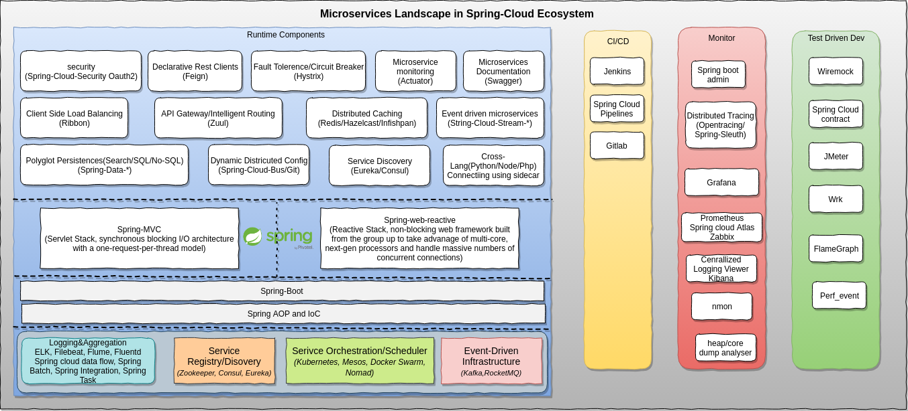
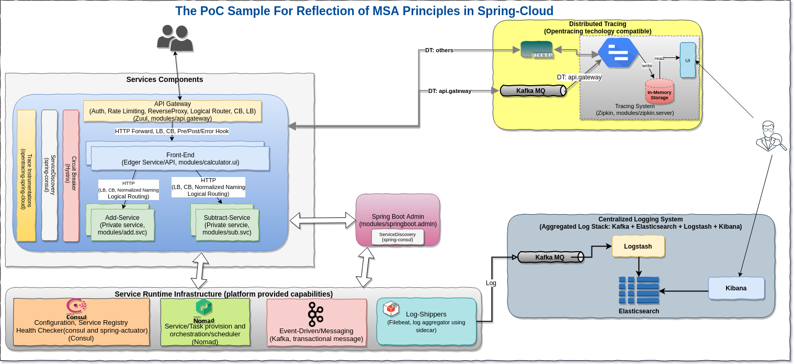
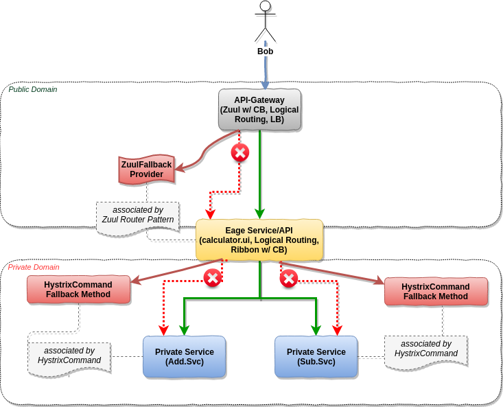
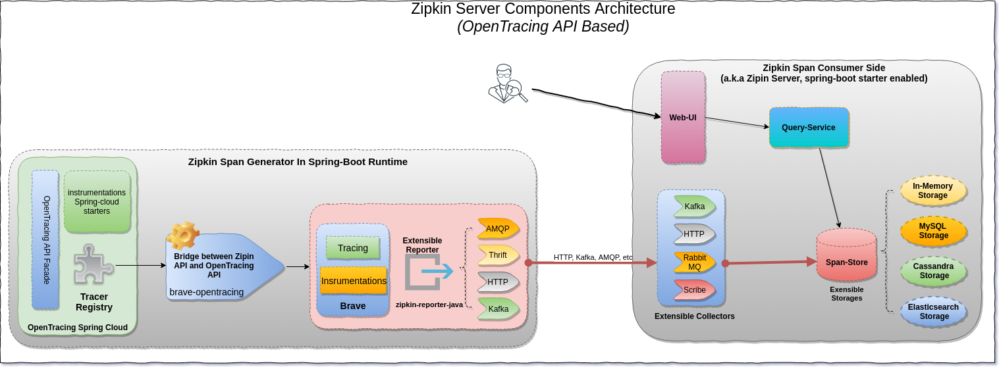

## Introduction

The purpose of this repository aims to provide a hands-on architecture PoC(proof-of-concept) sample that are easy to understand and demonstrate how to **build** and **run** a `microservices architecture`(MSA) application based on the ecosystem comprises of the excellent technologies offering by `Spring-Cloud`, `Hashicorp`, `Elastic`,  `Netflix` and etc. 

## Background

The rapidly growing of the cloud confirms that more and more applications either being built upon cloud-native technology or start to do the cloud transformation, as a result, the modern applications are either built upon microservices architecture or in the period of tranditional architectures (e.g: Monolithic or SOA) to micorservices.


### Architecture evolution


//TODO

A monolithic architecture makes sense for simple, lightweight applications. But please keep in mind, If your application is working well and doesn’t need changes, then adopting microservices will offer very little benefit.

//TODO, monolithic prod and cons here

The microservices architecture is a better choice for complex, evolving applications despite the drawbacks and implementation challenges. Traditional monolithic application architectures do not scale anymore. The database grows too large, or there are too many millions of lines of code, or you can no longer add features. Microservices are a response to hitting the ceiling. Microservices are not a silver bullet for challenges of monolithic architecture, but they can empower your team to reach new levels of scale and agility.

//TODO, MSA prod and cons here


### Runtime stack evolution 


#### Tranditional Architecture Runtime Stack


#### MSA Runtime Stack


### Bird's-eye view of cloud-native application platform(SaaS)


### Small team(~8 developers) code checkin process


### MSA runtime challenge 

#### Pack and deployment pattern

##### Virtualized deployable

##### Containerized deployable

##### Standalone deployable

#### Orchestration

The Microservices architecture apparently can highly reduce application complexity, but as a trade-off, it bring a high operational complexity, including an efficient runtime environment provision, service register/discovery, services orchestration/scheduler and etc. In short, **Building a microservcies != Running a microservices**. 

In monoliths, frameworks make the components work together seamlessly within a process via high modularity way, in Microservices, the service orchestration(scheduler) actually abstract the details(e.g: complex failure modes, logging aggregation, something need run alongside "main" process which need a sidecar or co-process pattern, and etc), focus on service composition, and ensure all the services which running in individual processes/nodes but still behaviors as running in single node and single process space. 

##### Isolation technologies

###### cgroup

###### namespace 

###### chroot

[chroot](http://man7.org/linux/man-pages/man2/chroot.2.html) is an operation that allows a system to change the root directory for current processes and its children


##### chroot vs. namespace

Creating separate mount namespace has an effect similar to doing a chroot(). chroot() is good, but it does not provide complete isolation, and its effects are restricted to the root mountpoint only. Creating a separate mount namespace allows each of these isolated processes to have a completely different view of the entire system’s mountpoint structure from the original one. This allows you to have a different root for each isolated process, as well as other mountpoints that are specific to those processes.

##### Lightweight Isolation techology(cgroup + chroot) 


##### Choice for Startup

`Why not kubernetes`

//TODO,

Honest question - what are the kind of *startups* (not bigcos) using kubernetes/nomad etc for a real use case that warrants these things?
Most startups have 1-2 ops people, maybe a fledgling ops team. A scheduler seems to be a huge investment at this stage.

//TODO, Run Java Driver for spring-boot application

//TODO, consolidate logs to centralized collector

This questions is maybe more suited for the google groups.
https://groups.google.com/forum/#!forum/nomad-tool

Couple of options I can think of:

Option 1:
A docker specific way would be within the docker task to configure logging and use some of the docker supported logging drivers.

https://www.nomadproject.io/docs/drivers/docker.html#logging
https://docs.docker.com/engine/admin/logging/overview/#supported-logging-drivers

Option: 2
You can also use sidecar (filebeat or similar) container that will ship files from the alloc/logs directory and it will run in the same group as you main task.
https://www.nomadproject.io/guides/operating-a-job/accessing-logs.html
group "my-group" {
  task "server" {
    # ...

    # Setting the server task as the leader of the task group allows us to
    # signal the log shipper task to gracefully shutdown when the server exits.
    leader = true
  }

  task "log-shipper" {
    # ...
  }
}

Option 3:
You can also run filebeat or similar on the host and ship logs from all allocations on that host /var/lib/nomad/allocs//alloc/logs/.std*.


[cloud-native-apps layers](https://www.nginx.com/blog/nginmesh-nginx-as-a-proxy-in-an-istio-service-mesh/)
The next layer on the stack is orchestration. Once you figure out how to package – once you figure out how to get your workloads into testing – you have to deal with orchestration‑type challenges: how do you take containers and assign them to computing jobs?

There are three major vendors there, maybe four if you include HashiCorp [which produces Nomad]: you have Kubernetes, Mesos, Docker Swarm, and Nomad. I would argue that, with about 40% of the market, Kubernetes is doing a good job trying to standardize that orchestration function.


[Why not Kubernetes?](https://medium.com/@copyconstruct/schedulers-kubernetes-and-nomad-b0f2e14a896)
[nomad and consul](https://blog.codecentric.de/en/2017/11/microservices-nomad-consul/)
[spring-cloud with consul and nomad](https://piotrminkowski.wordpress.com/2018/04/17/deploying-spring-cloud-microservices-on-hashicorps-nomad/)

//TODO
Drivers supported in Nomad, and corresponding isolation techologies


#### Interaction (calling among services)


##### Proxy pattern


##### RPC router pattern

###### Spring-Cloud

###### go-micro

##### Fabric pattern(Service Mesh)

### MSA data challenge

#### DDD

#### Write (consistent challenge)

##### CAP

##### TCC

##### Saga

##### Event driven architecture

###### Local TX based event

###### oplog tail

###### Event table (polling at consumer side)

###### 2PC MQ(RocketMQ)

###### Event Sourcing

Event sourcing is good for a system that needs audit trail and time travel. If the system in question needs only basic decoupling from a larger system, event-driven design is probably a better option.

#### Read

```sql
select * from order o, customer c
where o.customer_id = c.id
and o.gross_amount > 50000
and o.status = 'PAID'
and c.country = 'INDONESIA';

```

#### CQRS 

### CQRS + EventSourcing

#### Axon


## Microservices Landscape in Spring-Cloud ecosystem



## PoC Scenario 

### Overview



The PoC sample pursue to cover below functionalities:
 
 - Dev
    - `APIDoc`(Swagger based)
    - `TDD`
    - `Code Branch Management`
    
 - Service Interconnectivity(Application/Infrastructure Runtime)
    - `API-Gateway`(Edger service)
    - `Service Discovery`
    - `Intra-Communication Load Balance` (Private service)
    - `Circuit Breakers`
    - `Intelligent Routing`
    - `Distributed Tracing Instrumentation` (OpenTracing API based)
     
  - Service Orchestration (Infrastructure Runtime)
    - `Service Orchestration`(support hybrid deployables)
    - `Aggregated Logging`(which enabled via attaching a sidecar log-shipper task)
     
  - Ops
    - `Service Admin`
    - `Service Allocation Status` (Hashi-ui)
    - `Distributed Tracing Reporter`(Zipkin-ui)
    - `Centralized Logging Reporter` (Kibana)
    - `Java Memory Analysis`
    - `Java Core Dump Analysis`
    - `perf_event + flamegraph` profiling (Linux only)
    - `wrk`
 
 > Notable:
 >
 >    CI/CD refer to the combined practices of `continuous integration` and `continuous delivery`
 >  
 >    In order to keep the PoC sample as simple as possible, I didn't involve CI/CD features here. 

### Spring-Boot Modules

```

├── modules
│   ├── add.svc            // add operator service, which will be called by calculator-ui
│   │   ├── build.gradle
│   │   ├── out
│   │   └── src
│   ├── api.gateway       // api.gateway based on Zuul
│   │   ├── build.gradle
│   │   ├── out
│   │   └── src
│   ├── calculator.ui     // front-end service(edge service), which will be exposed on public cloud
│   │   ├── build.gradle
│   │   ├── out
│   │   └── src
│   ├── springboot.admin  // spring-boot admin service
│   │   ├── build.gradle
│   │   ├── out
│   │   └── src
│   ├── sub.svc           // subtract operator service, which will be called by calculator-ui
│   │   ├── build.gradle
│   │   ├── out
│   │   └── src
│   ├── turbine.aggr      // turbine aggregation service
│   │   ├── build.gradle
│   │   ├── out
│   │   └── src
│   └── zipkin.server     // Zipkin server(with HTTP and kafka collectors, in-memory span storage)
│       ├── build.gradle
│       ├── out
│       └── src


```

## Run the sample in standalone mode(w/o ops support)

### Start Consul (listening on port 8500)

```shell
  cd <CONSUL_HOME>
  ./bin/consul agent -dev
```

### Start Zookeeper and Kafka(bootstrap port 9092)

```shell
  cd <KAFKA_1.0_HOME>
  ./bin/zookeeper-server-start.sh ./config/zookeeper.properties
  ./bin/kafka-server-start.sh ./config/server.properties

```

In this sample, the `api-gateway` distributed tracing will be reported to Kafka topic `zipkin`, we can monitor that topic and verify the result:

```shell
  ./bin/kafka-console-consumer.sh --bootstrap-server localhost:9092 --topic zipkin
  
```

### Start Zipkin Server(web-ui listening on port 9411)

Either start Zipkin by Zipkin binary

```shell
 cd <ZIPKIN_SRC_HOME>
 ./mvnw -DskipTests --also-make -pl zipkin-server clean install
 KAFKA_BOOTSTRAP_SERVERS=localhost:9092 java -jar ./zipkin-server/target/zipkin-server-2.11.2-SNAPSHOT-exec.jar

```

 > 
 > Please refer to [zipkin native kafka collector auto-configure support](https://github.com/openzipkin/zipkin/tree/master/zipkin-autoconfigure/collector-kafka) for more details
 > 

or lanuch the Zipkin server via an embedded spring boot module

```shell
   cd modules/zipkin.server

   spring bootRun

```

### Start Spring-Boot-Admin(listening on port 9080)

```shell
  cd modules/springboot.admin
  gradle bootRun

```

### Start Turbine Aggration Server(listening on port 9090)

```shell
  cd modules/springboot.admin
  gradle bootRun

```

### Start api-gateway (listening on port 2809)

```shell
  cd modules/api.gateway
  gradle bootRun

```

### Start add service (dynamical port) 

```shell
  cd modules/add.svc
  gradle bootRun

```

### Start subtract service (dynamical port) 

```shell
  cd modules/sub.svc
  gradle bootRun

```

### Start calculator-ui service (dynamical port) 

```shell
  cd modules/calculator.ui
  gradle bootRun

```

### Run the sample via Command Line

```shell
  curl -X POST "http://localhost:2809/calculator-ui/api/v1/compute" -H "accept: application/json" -H "Content-Type: application/json" -d "{ \"expression\": \"1+1+2+3+4+5+6-1-2-3-4-5-6+9+8-4-5\"}"

```

### Run the sample with High load (assuming `wrk` is ready in your workstation)

calculator.lua:

```lua
wrk.method = "POST"
wrk.headers["Content-Type"] = "application/json"
wrk.body   = "{ \"expression\": \"1+1+2+3+4+5+6-1-2-3-4-5-6+9+8-4-5\"}"
```

```shell
   wrk -t 200 -c 200 -s ./scripts/calculator.lua -d 60s --latency http://localhost:2809/calculator-ui/api/v1/compute
   
```

## Circuit Breaker(Hystrix)

### Scenario




### Hystrix

 >
 > Please refer to [Hystrix](https://github.com/Netflix/Hystrix/wiki/How-it-Works) for more details about how Hystrix works.
 >


### Turbine Aggregation

```
   - Open browser and input url  http://localhost:9090/hystrix
   - Input dashboard stream url as below: 
        [1] http://localhost:9090/turbine.stream?cluster=api-gateway
        [2] http://localhost:9090/turbine.stream?cluster=calculator-ui
  
```


## Distributed Tracing

Microservices architecture faces certain challenges that are not common for monolithic systems – one of them is traceability of end-to-end transaction that is executed in distributed environment and that can potentially involve invocation of large number of diverse applications and services. In case of performance degradation or fatal exception thrown that is experienced in end-to-end solution, identication of bottleneck component/failure point become more and more diffcult. `Distributed tracking` is used to resolve the problems in this area.

> In this PoC sample, I'm using [`opentracing-spring-cloud`](https://github.com/opentracing-contrib/java-spring-cloud) instead of [`spring-cloud-sleuth`](https://github.com/spring-cloud/spring-cloud-sleuth), as it will bring us more benifits for cross porgramming languages environment, as well the switching from [Zipkin](https://github.com/openzipkin/zipkin) to others, e.g: [Jaeger](https://github.com/jaegertracing/jaeger).

`opentracing-spring-cloud` contains auto-configurations which can be enabled to instruments and trace following Spring Boot projects:

 - Spring Web (RestControllers, RestTemplates, WebAsyncTask)
 - @Async, @Scheduled, Executors
 - WebSocket STOMP
 - Feign, HystrixFeign
 - Hystrix
 - JMS
 - JDBC
 - Mongo
 - Zuul
 - RxJava
 - Standard logging - logs are added to active span
 - Spring Messaging - trace messages being sent through Messaging Channels
 - RabbitMQ

### Zipkin

#### Components Architecture (includes both span generator side and consumer side)



#### Workflow

 >
 > Below is the description from [zipkin architecture doc](https://github.com/openzipkin/openzipkin.github.io/blob/master/pages/architecture.md)
 >


Here's an example sequence of http tracing where user code calls the resource
/foo. This results in a single span, sent asynchronously to Zipkin after user
code receives the http response.

```
┌─────────────┐ ┌───────────────────────┐  ┌─────────────┐  ┌──────────────────┐
│ User Code   │ │ Trace Instrumentation │  │ Http Client │  │ Zipkin Collector │
└─────────────┘ └───────────────────────┘  └─────────────┘  └──────────────────┘
       │                 │                         │                 │
           ┌─────────┐
       │ ──┤GET /foo ├─▶ │ ────┐                   │                 │
           └─────────┘         │ record tags
       │                 │ ◀───┘                   │                 │
                           ────┐
       │                 │     │ add trace headers │                 │
                           ◀───┘
       │                 │ ────┐                   │                 │
                               │ record timestamp
       │                 │ ◀───┘                   │                 │
                             ┌─────────────────┐
       │                 │ ──┤GET /foo         ├─▶ │                 │
                             │X-B3-TraceId: aa │     ────┐
       │                 │   │X-B3-SpanId: 6b  │   │     │           │
                             └─────────────────┘         │ invoke
       │                 │                         │     │ request   │
                                                         │
       │                 │                         │     │           │
                                 ┌────────┐          ◀───┘
       │                 │ ◀─────┤200 OK  ├─────── │                 │
                           ────┐ └────────┘
       │                 │     │ record duration   │                 │
            ┌────────┐     ◀───┘
       │ ◀──┤200 OK  ├── │                         │                 │
            └────────┘       ┌────────────────────────────────┐
       │                 │ ──┤ asynchronously report span     ├────▶ │
                             │                                │
                             │{                               │
                             │  "traceId": "aa",              │
                             │  "id": "6b",                   │
                             │  "name": "get",                │
                             │  "timestamp": 1483945573944000,│
                             │  "duration": 386000,           │
                             │  "annotations": [              │
                             │--snip--                        │
                             └────────────────────────────────┘
```

Trace instrumentation report spans asynchronously to prevent delays or failures
relating to the tracing system from delaying or breaking user code.

### Zipkin-UI


## Spring Boot Admin UI


//TODO, more deep dive usage

## APIDoc(Swagger)

In Spring-Cloud, the RESTful API actually play the key role in the ecosystem. Why/How do we document our RESTful API?

### Why

The most important design principle for RESTful Services is `Think about consumer of the API`, Not like SOAP-Based Web service, REST does not provide a spec or a contract like `WSDL` in SOAP. Indeed, REST gives you the flexibility to choose proper documentation format and approach. But that does not mean “No documentation”. We do need to document our API.

### How

- Poor man's option is to maintain documentation manually. But that gets you to much boring work for the doc to sync up with the latest code, and also versioning work.

- An Other option is to generate documentation from code. Spring-Cloud provides an easy way to do this. The PoC


There are multiple approaches to documenting your RESTful API

    - [WADL](https://javaee.github.io/wadl/)
    - RESTDocs                                          
    - Swagger or OpenDocs
    
Swagger appears in the last couple of years and is now the most popular REST API documentation standard. We will use it in our sample for APIDoc generation

### Generating Swagger Document

To generate swagger document, [springfox](https://springfox.github.io/springfox/) currently provides a popular solution in spring-boot. We just need to introduce the dependence to `springfox-swagger2`, configure the Docket, using the appropriate annotations on the API router, method and models, then the swagger document will be generated automatically. 
Access it via:

```
    http://<hostname>:<port>/v2/api-docs
```

If we want a visual UI and execute the API with test request, just add a dependence to `springfox-swagger-ui`. and open below link in browser:

```
    http://<hostname>:<port>/swagger-ui.html
```


## Test Driven

//TODO

## Performance Testing/Analyse

### FlameGraph with Perf_Event (Linux only)

#### Prerequisites

- Have perf_event tool installed on your linux environment

   ```
      On Ubuntu
      
      sudo apt-get install -y linux-tools-common
      
   ```

  >
  > The sample was verified on ubuntu with kernel below:
  >
  > _Linux lizh-laptop 4.4.0-72-generic #93~14.04.1-Ubuntu SMP Fri Mar 31 15:05:15 UTC 2017 x86_64 x86_64 x86_64 GNU/Linux_
  
- Using JDKv8(>=v8u60) or JDKv9 to support `-XX:+PreserveFramePointer`
  ```
    $ java -version
    java version "1.8.0_60"
    Java(TM) SE Runtime Environment (build 1.8.0_60-b27)
    Java HotSpot(TM) 64-Bit Server VM (build 25.60-b23, mixed mode)
  ```
- Set JAVA_HOME properly
  ```
    export JAVA_HOME=<YOUR_JDK_HOME>
  ```
- Install [perf-map-agent](https://github.com/jrudolph/perf-map-agent)

  `perf-map-agent` is the instrument tool to translate the `Java Symbols` for `perf_event`, that means perf_event will read the map to unerstand the `VMA`(Virutal Memory Address) to corresponding Java symbols, and generate a human readble report 
  ```
     sudo apt-get install -y cmake    
     git clone https://github.com/jrudolph/perf-map-agent
     cd perf-map-agent
     cmake .
     make
  ```
  `attach-main.jar` and `libperfmap.so` get compiled in the out folder
- Create command links in `<HOME>/bin`
  ```
     cd <perf-map-agent_HOME>/bin
     ./create-links-in <HOME>/bin
  ```
  A soft link for `perf-java-flames` command will be created in `<HOME>/bin`, so we can use this command anywhere without the need of full path specified.
- Install [FlameGraph](https://github.com/brendangregg/FlameGraph)
  ```
     git clone https://github.com/brendangregg/FlameGraph
     export FLAMEGRAPH_DIR=<FlameGraph_HOME>
  ```

#### Profiling Java(on-cpu-sampling)

- Run Java process with `-XX:+PreserveFramePointer`, e.g:
  ```
     cd <modules>/calculator.ui
     java -XX:+PreserveFramePointer -jar ./out/libs/calculator.ui-1.0.0.jar
  ```
- Check it is enabled(on Linux)
  ```
    ps wwp `pgrep -n java` | grep PreserveFramePointer
  ```
- Profiling and generate flamegraph for the Java process
  ```
     perf-java-flames <pid>
  ```

- Sample result


### Heap Analysis

//TODO

### Core-dump Analysis

//TODO


## Run sample in full-feature mode(with ops support)

### Folder structure

```
ops
├── Vagrantfile   // Vagrant file
├── ansible       // ansible scripts for install and start services, including: commoent runtime dependences, zookeeper, kafka, nginx(for local pkgs repo), install JVM, filebeat, consul, nomad, elasticsearch, logstash, kibana and wrk
├── bin           // script, including boostrap.sh, click.sh(fire an invocation on the sample), kafka-*-monitor.sh, start_all_jobs.sh and stop_all_jobs.sh
├── deployable    // nomad job definition files(hcl) for microservices
├── deps          // binary dependences, which cache it locally to reduce(avoid) network deps during demonstration
├── dist          // pkgs publish folder, nginx is started on this folder to simulate a pkg repository
└── log-shipper   // filebeat conf for log-shipper side-task

```

### How to run

#### Pack

To keep the sample simple, I didn't introduce a real CI dependence(e.g: usually gitlab, jenkins, etc) here. Just create a gradle `deploy` task to pack the deployables to a folder named `dist`. Later, when the VM provisioned, the `nginx` will start up and provide a http pkgs server on that folder.

```shell
    cd <hello_springcloud_home>
    gradle clean build
    gradle deploy
    
``` 

#### Launch VM

The sample is using `[vagrant](https://www.vagrantup.com/docs/installation/)` to manage the VM. Make sure you have `vagrant` installed on your host.

```shell
  vagrant up
  
```

#### Install&Startup all of runtime dependences

All of runtime dependences, including common dependences, elasticsearch, filebeat, hashi-ui, JAVA-v8, kafka, kibana, logstash, nginx, nomad, wrk and zookeeper are managed via ansible, which will be initialized during VM provision. 

```shell
   vagrant provision
   
```

#### Start all jobs

```shell
  vagrant ssh
  cd /vagrant/bin
  ./start_all_jobs.sh

```

#### Launch Hashi-UI

Open the browser on your host with url "http://10.10.10.200:3000"

##### Cluster overview shown in Hashi-UI


##### Jobs status in Hashi-UI


##### Overall allocations status in Hashi-UI


##### Allocation status in Hashi-UI


##### Consul status in Hashi-UI


#### Run the sample

```shell
   vagrant ssh
   cd /vagrant/bin
   ./click.sh
```

If the sample run successfully, you will see output in stdout as below:

```json

{"result":9}

```

#### Monitor the Kafka distributed tracing topic(zipkin)

In this sample, only apigateway's distributed tracing is reported to kafka. Other services will report trace via HTTP protocol

```shell

   vagrant ssh
   cd /vagrant/bin
   ./kafka-zipkin-topic-monitor.sh

```

run the sample, you will see the message like below:

```json

    [{"traceId":"ebe29e701126f8a2","parentId":"ebe29e701126f8a2","id":"499be36840d38ffb","name":"post","timestamp":1536129010924681,"duration":32367,"localEndpoint":{"serviceName":"api-gateway","ipv4":"10.0.2.15"},"tags":{"component":"zuul","http.status_code":"200"}},{"traceId":"ebe29e701126f8a2","id":"ebe29e701126f8a2","kind":"SERVER","name":"post","timestamp":1536129010924004,"duration":34677,"localEndpoint":{"serviceName":"api-gateway","ipv4":"10.0.2.15"},"tags":{"component":"java-web-servlet","http.method":"POST","http.status_code":"200","http.url":"http://10.10.10.200:2809/calculator-ui/api/v1/compute"}}]

```

#### Monitor the Kafka aggregated logging topic(api-gateway-filebeat)

In this sample, only apigateway's aggregated logging is shipped to kafka. Other services will shipped to filebeat's stdout.

```shell

   vagrant ssh
   cd /vagrant/bin
   ./kafka-filebeat-topic-monitor.sh

```

run the sample, you will see the message like below:

```

    {"@timestamp":"2018-09-05T06:34:20.283Z","@metadata":{"beat":"filebeat","type":"doc","version":"6.4.0","topic":"api-gateway-filebeat"},"input":{"type":"log"},"beat":{"version":"6.4.0","name":"hello-springcloud","hostname":"hello-springcloud"},"host":{"name":"hello-springcloud"},"source":"/data/nomad/data/alloc/c24d5f7a-c476-9aec-da51-6274a8e990e5/alloc/logs/api-gateway-task.stdout.0","offset":916841,"message":"[DEBUG]: [Enter]: [POST] -\u003e http://10.10.10.200:2809/calculator-ui/api/v1/compute","prospector":{"type":"log"}}
    {"@timestamp":"2018-09-05T06:34:20.283Z","@metadata":{"beat":"filebeat","type":"doc","version":"6.4.0","topic":"api-gateway-filebeat"},"message":"[DEBUG]: \u003e\u003e\u003e Content-Type: application/json","source":"/data/nomad/data/alloc/c24d5f7a-c476-9aec-da51-6274a8e990e5/alloc/logs/api-gateway-task.stdout.0","offset":916923,"prospector":{"type":"log"},"input":{"type":"log"},"beat":{"name":"hello-springcloud","hostname":"hello-springcloud","version":"6.4.0"},"host":{"name":"hello-springcloud"}}
    {"@timestamp":"2018-09-05T06:34:20.283Z","@metadata":{"beat":"filebeat","type":"doc","version":"6.4.0","topic":"api-gateway-filebeat"},"source":"/data/nomad/data/alloc/c24d5f7a-c476-9aec-da51-6274a8e990e5/alloc/logs/api-gateway-task.stdout.0","prospector":{"type":"log"},"input":{"type":"log"},"beat":{"name":"hello-springcloud","hostname":"hello-springcloud","version":"6.4.0"},"host":{"name":"hello-springcloud"},"offset":916967,"message":"[DEBUG]: [Exit]: [POST] [200] \u003c- http://10.10.10.200:2809/calculator-ui/api/v1/compute"}
    
```

#### Run benchmark

```shell

   vagrant ssh
   cd /vagrant/bin
   ./benchmark.sh

```

Output:

```output
Running 1m test @ http://localhost:2809/calculator-ui/api/v1/compute
  5 threads and 5 connections
  Thread Stats   Avg      Stdev     Max   +/- Stdev
    Latency   123.07ms  158.81ms   1.88s    95.71%
    Req/Sec    11.32      6.36    40.00     56.93%
  Latency Distribution
     50%   87.95ms
     75%  138.00ms
     90%  205.89ms
     99%    1.01s 
  2985 requests in 1.00m, 437.76KB read
Requests/sec:     49.72

```

#### Observe Distributed Tracing Result

Open browser on host machine with url `http://10.10.10.200:9411`


#### Observe centralized logging

Open browser on host machine with url `http://10.10.10.200:5601`


#### Stop all jobs

```shell

  vagrant ssh
  cd /vagrant/bin
  ./stop_all_jobs.sh
  
```
